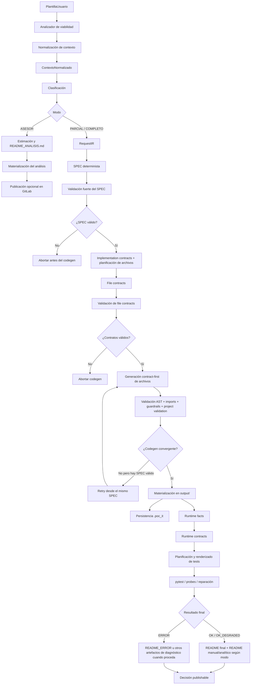

# PoC-it

PoC-it es un sistema de generación automática de pruebas de concepto backend a partir de una descripción funcional de alto nivel introducida por el usuario.

No funciona como un simple “prompt que devuelve código”. El repositorio implementa un pipeline con varias fuentes de verdad intermedias y distintos gates de validación para intentar mantener alineadas estas capas:

```text
PlantillaUsuario
    │
    ▼
ContextoNormalizado
    │
    ▼
RequestIR
    │
    ▼
SPEC
    │
    ├── endpoints
    ├── integraciones
    ├── configuración
    ├── persistencia
    ├── test_strategy
    ├── implementation_contracts
    └── file_contracts
    │
    ▼
Código generado y materializado
    │
    ▼
Runtime facts / runtime contracts
    │
    ▼
Tests
    │
    ▼
Documentación y decisión final de publicación
```

La idea arquitectónica central es que cada fase no tenga que reinterpretar desde cero la petición del usuario. PoC-it intenta trasladar conocimiento estructurado de una fase a la siguiente, validando por separado:

- defectos de contrato, cuando la especificación intermedia no representa correctamente lo pedido;
- defectos de implementación, cuando el contrato es razonable pero el código generado no lo cumple.

---

## Objetivo

El objetivo de PoC-it es producir una PoC backend ejecutable —o, si no es viable materializarla, un análisis estructurado— a partir de necesidades funcionales descritas en lenguaje natural.

En el flujo completo del repositorio actual, PoC-it intenta:

1. entender la intención funcional del usuario;
2. normalizarla en un contexto estructurado;
3. clasificar la viabilidad y el modo de trabajo;
4. construir una especificación técnica determinista;
5. derivar contratos por archivo y relaciones internas;
6. generar código guiado por esos contratos;
7. validar estructura, wiring e imports;
8. materializar el proyecto en `output/<nombre>/`;
9. extraer hechos reales del código materializado;
10. generar tests alineados con lo que realmente quedó generado;
11. ejecutar y, si procede, reparar;
12. generar documentación final;
13. decidir si el resultado es publicable.

---

## Visión general del pipeline

### Diagrama completo



---

## 1. Entrada: `PlantillaUsuario`

La entrada de usuario real del programa se recoge en `poc_it/main.py` mediante una plantilla interactiva de seis preguntas:

1. Nombre de la PoC  
2. ¿Qué problema resuelve?  
3. ¿Quién utilizará el sistema?  
4. ¿Qué debería poder hacer el sistema?  
5. ¿Hay reglas o límites importantes?  
6. ¿Qué tecnologías/integraciones necesita?  

Estas respuestas se transforman en una instancia de `PlantillaUsuario`.

### Qué significa esto en la práctica

El usuario **no** tiene que describir manualmente:

- endpoints concretos;
- estructura de carpetas;
- clases;
- routers;
- configuración interna;
- wiring;
- tests.

PoC-it parte de una descripción funcional de alto nivel. Por ejemplo, una petición como:

> “La aplicación debe permitir subir documentos a un almacenamiento externo”

puede dar lugar a inferencias posteriores sobre:

- capacidades funcionales;
- posibles contratos API;
- integraciones externas;
- configuración necesaria;
- operaciones o acciones;
- archivos esperados;
- dependencias entre módulos.

La arquitectura actual del proyecto intenta que esas inferencias no aparezcan de forma arbitraria en el codegen final, sino que queden reflejadas antes en estructuras intermedias.

---

## 2. Normalización del contexto

Una de las piezas más importantes del repositorio actual es `poc_it/analisis/normalizador_contexto.py`.

Su responsabilidad no es generar código, sino convertir la descripción libre del usuario en una representación estructurada que PoC-it pueda transportar y validar en fases posteriores.

El resultado se conserva en un `ContextoNormalizado`.

### Qué persigue la normalización

Conceptualmente, la normalización intenta:

- completar la forma esperada de los datos;
- aplicar fallbacks seguros;
- normalizar valores y nomenclaturas;
- separar hechos explícitos de inferencias propuestas;
- reconciliar integraciones y referencias tecnológicas;
- evitar confundir una tecnología o runtime con una integración externa;
- conservar evidencia, preguntas abiertas e incertidumbre.

### Información explícita e inferida

En el flujo actual, PoC-it distingue entre información:

- **explícita**: aquello que el usuario ha dicho o insinuado de forma suficientemente directa;
- **propuesta o inferida**: aquello que PoC-it sugiere para poder continuar estructurando la solución.

Esta separación es especialmente importante en los contratos API, porque el código actual distingue entre:

- `explicit_api_contracts`
- `proposed_api_contracts`

La idea es no tratar igual un endpoint literalmente pedido por el usuario que un endpoint que PoC-it propone como forma plausible de materializar una capacidad.

### Contenido estructurado del contexto

Según los modelos y el flujo actual, el contexto normalizado puede contener, entre otros, conceptos como:

- funcionalidades clave;
- actores principales;
- objetivo técnico;
- restricciones técnicas;
- contratos API;
- integraciones externas;
- configuración;
- persistencia;
- señales tecnológicas;
- entidades de dominio;
- grupos de operaciones;
- requisitos de estado;
- cobertura de capacidades;
- preguntas abiertas;
- evidencia y supuestos.

No todas las peticiones llenarán todos los campos, pero la normalización intenta producir una estructura coherente con defaults seguros.

### Tecnologías vs integraciones

El normalizador también participa en una separación arquitectónica importante:

- una **tecnología** describe herramientas, runtimes, frameworks o paquetes;
- una **integración externa** describe una dependencia funcional con un sistema externo.

Ejemplos orientativos:

- `FastAPI`, `Python`, `Cloud Run` o ciertos paquetes suelen encajar mejor como señales tecnológicas;
- un proveedor externo consumido por la PoC encaja mejor como integración funcional.

PoC-it intenta no convertir automáticamente toda mención tecnológica en una integración externa.

### Trazabilidad e incertidumbre

El contexto no solo transporta “lo que se sabe”, sino también:

- evidencia procedente del texto del usuario;
- supuestos que el pipeline va introduciendo;
- preguntas abiertas cuando algo sigue sin estar completamente fijado.

Eso es importante porque la siguiente fase no debería “inventar” sin dejar rastro qué ha venido del usuario y qué ha sido asumido por el sistema.

---

## 3. Clasificación de viabilidad

Tras recoger la plantilla y normalizar el contexto, PoC-it ejecuta el análisis de viabilidad y decide el modo de funcionamiento.

Este paso vive principalmente en:

- `poc_it/analisis/analizador_viabilidad.py`
- `poc_it/analisis/clasificador.py`
- `poc_it/analisis/estimador_esfuerzo.py`

La clasificación no se usa solo para etiquetar la petición, sino para seleccionar una política de pipeline.

---

## Modos de funcionamiento

PoC-it distingue tres modos:

- `PARCIAL`
- `COMPLETO`
- `ASESOR`

### PARCIAL

En la versión actual del repositorio, `PARCIAL` **no** significa “generar solo una parte de los archivos”.

El flujo real sigue materializando un proyecto completo y puede recorrer el pipeline de:

- SPEC;
- file contracts;
- generación de código;
- materialización;
- runtime facts/contracts;
- generación de tests;
- documentación.

La diferencia práctica está en las políticas de ejecución y validación posteriores, especialmente alrededor de:

- integraciones externas;
- hermeticidad de tests;
- uso de stubs, fakes u overrides cuando procede;
- probes o validaciones best-effort;
- criterios de reparación y degradación;
- artefactos documentales adicionales como `README_MANUAL.md`.

En otras palabras: el modo PARCIAL sigue produciendo una PoC backend completa, pero con una estrategia más conservadora en torno a runtime real, dependencias externas y reproducibilidad.

### COMPLETO

`COMPLETO` activa la misma familia general de pipeline materializable, pero con una política menos restrictiva que PARCIAL cuando el contexto sugiere que es razonable validar más comportamiento real.

No implica simplemente “más archivos”. La diferencia real está más cerca de:

- cómo se tratan las integraciones;
- qué runtime se intenta verificar;
- qué estrategia de tests se adopta;
- qué reparaciones se permiten después de pytest o runtime;
- qué se considera suficiente para publicar.

La clasificación final del proyecto generado incluye estados como:

- `valid_local`
- `valid_integration_skeleton`
- `generated_with_errors`
- `invalid`
- `failed`
- `file_contract_validation_failed`

y esa clasificación es más relevante que una lectura superficial del nombre del modo.

### ASESOR

`ASESOR` no recorre el mismo camino de materialización de una PoC backend ejecutable.

En este modo, el sistema se orienta a:

- análisis estratégico;
- opciones arquitectónicas;
- estimación conceptual;
- documentación del problema y posibles caminos técnicos.

El artefacto principal es un `README_ANALISIS.md` materializado en `output/<nombre>/`, y el flujo no depende de una generación completa de código ejecutable.

### Comparativa de modos

| Modo | ¿Genera código materializable? | Integraciones | Estrategia de tests | Runtime | Resultado principal |
|---|---|---|---|---|---|
| PARCIAL | Sí | Tratamiento conservador; favorece aislamiento y reproducibilidad | Enfocada a tests herméticos y overrides/fakes cuando procede | Verificaciones y probes controlados | PoC ejecutable si converge, con documentación adicional |
| COMPLETO | Sí | Puede admitir validación más ambiciosa según el contrato real | Tests derivados de spec + runtime facts/contracts | Runtime y pytest usados como gates de publicación | PoC ejecutable si converge |
| ASESOR | No en el mismo sentido | Se analizan conceptualmente | No sigue el pipeline completo de tests materializados | No recorre la misma validación runtime | `README_ANALISIS.md` y estimación |

---

## 4. Generación del SPEC

La generación del SPEC es el centro del pipeline materializable.

El flujo relevante arranca en:

- `generar_proyecto_completo(...)` de `poc_it/materializacion/generador_artefactos.py`

y pasa por:

- `build_request_ir_from_context(...)`
- `build_spec_from_request_ir(...)`

### SPEC como fuente de verdad intermedia

El SPEC es una representación técnica determinista construida a partir del `RequestIR`, no directamente desde texto libre.

Esa distinción es importante:

- el texto del usuario se normaliza;
- el contexto normalizado se traduce a `RequestIR`;
- el SPEC se construye de forma determinista desde ese `RequestIR`.

El código actual de `poc_it/generador/spec_builder.py` declara explícitamente estos principios:

- no usa LLM;
- no interpreta texto libre;
- `RequestIR` es la única fuente de verdad previa al SPEC;
- el SPEC debe ser mínimo, versionado y validable.

### Campos relevantes del SPEC actual

Sin copiar el schema completo, los bloques más importantes del SPEC real incluyen:

- `schema_version`
- `status`
- `entrypoint`
- `run_command`
- `imports_policy`
- `files`
- `dependencies`
- `dev_dependencies`
- `env`
- `endpoints`
- `contracts`
- `assumptions`
- `open_questions`
- `technology_signals`
- `integrations`
- `configuration`
- `source`
- `persistence`
- `test_strategy`

En fases posteriores también se enriquecen campos relacionados con implementación, como:

- `implementation_files`
- `restrictions`

### Qué expresa el SPEC

El SPEC no es todavía el código. Es una fuente de verdad técnica sobre:

- qué archivos deberían existir;
- qué endpoints deberían existir;
- qué configuración es necesaria;
- qué dependencias aparecen;
- qué integraciones están reconocidas;
- qué persistencia se ha detectado;
- qué estrategia general de test aplica;
- qué se sabe por evidencia y qué se está asumiendo.

### Ejemplo conceptual simplificado

> Este ejemplo es pedagógico y simplificado. No representa un schema completo ni garantiza nombres exactos de endpoints o archivos.

```json
{
  "schema_version": "pocit.spec.v1",
  "entrypoint": "app.main:app",
  "files": [
    "app/main.py",
    "app/api/router.py",
    "app/api/endpoints/upload.py",
    "app/core/config.py",
    "app/integrations/storage_api.py",
    "requirements.txt",
    "README.md"
  ],
  "endpoints": [
    {
      "method": "POST",
      "path": "/upload",
      "file": "app/api/endpoints/upload.py",
      "integration_refs": ["storage_service"]
    }
  ],
  "integrations": [
    {
      "id": "storage_service",
      "kind": "external_api"
    }
  ],
  "configuration": [
    {
      "key": "STORAGE_BUCKET",
      "required": true,
      "delivery": "env"
    }
  ],
  "test_strategy": {
    "level": "openapi_contract",
    "requires_dependency_overrides": true
  }
}
```

---

## 5. Validación fuerte del SPEC

PoC-it no salta del “contexto” al “codegen” sin gates.

En `generador_artefactos.py` el SPEC pasa por varias comprobaciones antes de continuar:

1. **trazabilidad** entre `RequestIR` y SPEC;
2. **validación fuerte** del SPEC;
3. **reparación determinista** del SPEC si aparecen errores fatales reparables;
4. **nuevo intento de validación** sobre el SPEC reparado;
5. **aborto** si siguen existiendo errores fatales.

### Errores fatales y abortos tempranos

La política actual es clara: si el SPEC mantiene errores fatales después del intento de reparación determinista, el pipeline puede detenerse **antes de materializar código**.

Conceptualmente, esto evita un problema muy común en pipelines generativos:

> intentar “arreglar” en el código una especificación que ya era inconsistente.

### Qué se conserva en debug

Durante esta fase se persisten artefactos como:

- `spec_base.json`
- `spec_base_<timestamp>.json`
- `spec_repaired_<timestamp>.json`
- `spec_validation_errors.json`
- `spec_validation_warnings.json`
- `spec_traceability_errors.json`
- `spec_repair_changes.json`

en `output/_debug/`.

---

## 6. `file_contracts`

### Qué son

`file_contracts` es una de las piezas más importantes de la arquitectura actual.

No son simplemente una lista de nombres de archivo. Son contratos por archivo derivados del SPEC, construidos en `poc_it/generador/file_contracts.py`, que describen qué espera PoC-it de cada archivo y cómo debe relacionarse con los demás.

### Problema que resuelven

Sin `file_contracts`, cada archivo podría ser generado como una respuesta aislada del LLM, sin saber:

- qué símbolos espera otro módulo;
- qué imports están permitidos;
- qué responsabilidades no le corresponden;
- qué acciones o integraciones debe ejecutar;
- qué wiring espera el resto del proyecto.

Los `file_contracts` actúan como una interfaz intermedia para reducir esa desalineación.

### Información contractual real

El modelo `FileContract` actual incluye, entre otros, campos como:

- `path`
- `kind`
- `responsibilities`
- `required_symbols`
- `allowed_imports`
- `forbidden_imports`
- `endpoints`
- `endpoint_contracts`
- `dependencies`
- `env`
- `persistence`
- `test_strategy`
- `source`
- `notes`
- `implementation_contracts`
- `must_implement`
- `must_not`
- `implementation_plan`
- `actions`
- `errors`
- `integration_refs`
- `external_dependencies`
- `implementation_levels`
- `configuration`
- `configuration_access`
- `authentication_constraints`
- `authentication_runtime_contract`
- `provided_interfaces`
- `required_internal_calls`
- `included_routers`
- `routing_convention`
- `owned_action_refs`
- `data_contracts`
- `data_flows`

### Qué expresa cada contrato

Según el tipo de archivo (`main`, `router`, `endpoint`, `integration`, `config`, `test`, `requirements`, etc.), el contrato puede fijar:

- símbolos obligatorios, como `app`, `api_router`, `router`, `Settings`, `get_settings` o `build_client`;
- responsabilidades permitidas y responsabilidades prohibidas;
- imports permitidos;
- módulos que deben incluirse;
- endpoints que “pertenecen” a ese archivo;
- configuración a la que puede acceder;
- restricciones de autenticación;
- interfaces que debe proporcionar a otros módulos;
- llamadas internas requeridas entre productor y consumidor;
- acciones asociadas a integraciones o persistencia;
- notas de diseño y obligaciones semánticas.

### Relaciones productor/consumidor

Una parte especialmente importante de `file_contracts` es que añade relaciones explícitas entre archivos:

- un archivo puede **proveer interfaces** (`provided_interfaces`);
- otro archivo puede **requerir llamadas internas** (`required_internal_calls`) contra esas interfaces.

Eso permite expresar, por ejemplo, que:

- un endpoint no debe implementar directamente un SDK;
- una integración debe exponer una función concreta;
- el endpoint consumidor debe importar ese módulo y llamar al símbolo adecuado.

### Validaciones sobre file contracts

Los `file_contracts` pasan por un gate de validación propio (`file_contracts_validation.py`).

Si ese gate falla, el pipeline devuelve un estado como:

- `file_contract_validation_failed`

y no continúa con la generación materializable normal.

### Uso posterior de los file contracts

Los contratos por archivo se utilizan después para:

- codegen contract-first;
- validación estructural del proyecto generado;
- validación de símbolos, wiring e imports;
- detección de incoherencias entre archivos;
- reparación semántica del proyecto generado.

---

## 7. Integraciones externas

PoC-it modela explícitamente las integraciones externas en el SPEC y las arrastra a las fases de contratos, implementación y tests.

### Qué es una integración en este repositorio

Una integración es una dependencia funcional externa del backend generado, no simplemente una tecnología mencionada.

En el SPEC y en los contratos aparecen conceptos como:

- `integrations`
- `integration_refs`
- `technology_signals`
- `configuration`
- `actions`
- `errors`
- `authentication`

### Tecnología vs integración

Esta separación es intencional:

- `technology_signals` describe señales tecnológicas: frameworks, paquetes, import roots, etc.
- `integrations` describe sistemas externos con los que la PoC debe interactuar funcionalmente.

El código actual incluso utiliza las referencias tecnológicas para derivar, cuando procede:

- paquetes;
- `allowed_imports`;
- `import_roots`;
- restricciones de autenticación;
- módulos internos de integración.

### Cómo condicionan el pipeline

Cuando una integración es reconocida, puede afectar a:

```text
ContextoNormalizado
→ RequestIR
→ SPEC
→ implementation_contracts
→ file_contracts
→ codegen
→ runtime contracts
→ tests
```

Por ejemplo, en `file_contracts.py` una integración puede terminar reflejada en:

- `integration_refs`
- `external_dependencies`
- `configuration_refs`
- `authentication_constraints`
- `authentication_runtime_contract`
- responsabilidades específicas del archivo `app/integrations/...`
- imports permitidos o módulos de integración internos.

### Integraciones y configuración

PoC-it también propaga la configuración asociada a integraciones:

- variables de entorno (`env`);
- claves requeridas;
- si una credencial es secreta;
- modo de entrega (`delivery`);
- política de acceso a configuración vía `app.core.config:get_settings`.

---

## 8. Planificación de implementación y contratos adicionales

Antes del codegen final, PoC-it enriquece el SPEC con planificación adicional.

En `generador_artefactos.py` aparecen pasos como:

- `build_implementation_contracts_from_spec(...)`
- `enrich_spec_files_for_implementation(...)`
- `compilar_restricciones(...)`

Esto introduce una capa intermedia entre el SPEC “mínimo” y la generación final de archivos.

### Qué añade esta fase

Sin entrar en todos los detalles internos, esta planificación refuerza:

- asignación de responsabilidades de implementación;
- archivos adicionales requeridos para integraciones;
- relación entre endpoints y módulos internos;
- restricciones que luego se usarán como guardrails;
- contratos de implementación por endpoint o por integración.

---

## 9. Generación de código

La transformación de SPEC + contratos en archivos generados se coordina desde:

- `poc_it/materializacion/generador_artefactos.py`
- `poc_it/materializacion/codegen/`

El mecanismo central es contract-first:

- se construyen `file_contracts`;
- se usa un generador por contrato;
- un orquestador compone el proyecto resultante.

### SPEC válido no implica código válido

Una distinción importante del repositorio actual:

- un **SPEC válido** significa que la especificación es coherente y materializable;
- un **código válido** significa además que los archivos generados cumplen los contratos y superan los gates del proyecto generado.

PoC-it no asume que porque el contrato esté bien, el LLM lo implementará correctamente.

### Gates de validación del proyecto generado

Después del codegen, el repositorio ejecuta varias validaciones:

1. validación AST del proyecto;
2. validación estructural contra `file_contracts`;
3. validación semántica de proyecto generado;
4. validación de imports internos;
5. guardrails compilados desde el SPEC;
6. clasificación del estado del proyecto generado.

### Estados relevantes de codegen

La clasificación del proyecto generado utiliza estados como:

- `valid_local`
- `valid_integration_skeleton`
- `invalid`

y el flujo también devuelve estados operativos como:

- `failed`
- `generated_with_errors`
- `file_contract_validation_failed`

`materializable` solo pasa a `True` cuando el estado pertenece a los materializables definidos por el código actual:

- `valid_local`
- `valid_integration_skeleton`

### Reparación semántica durante codegen

Si la validación semántica del proyecto generado detecta errores bloqueantes, PoC-it puede intentar una reparación con varias rondas limitadas antes de aceptar o rechazar el proyecto.

También puede intentar reparar:

- imports internos;
- infracciones de guardrails;

pero esas reparaciones pasan por validación posterior y rollback si empeoran el estado.

---

## 10. Retry desde el mismo SPEC

Una decisión importante del orquestador actual es que, si falla la primera generación de código pero ya existe un SPEC válido, PoC-it puede reutilizar ese SPEC como fuente de verdad para un nuevo intento.

```text
Contexto
   ↓
SPEC válido
   ↓
Codegen intento 1
   ↓
fallo o no convergencia
   ↓
reutilizar el mismo SPEC
   ↓
nuevo intento de codegen
```

### Por qué importa

Esto evita reinterpretar desde cero la petición del usuario cada vez que falla la implementación.

Dicho de otro modo:

- el problema funcional ya estaba normalizado;
- el contrato técnico ya estaba construido;
- el fallo ahora pertenece a la implementación o a la convergencia del codegen.

El retry desde SPEC intenta respetar esa separación.

---

## 11. Materialización

Una vez existe un conjunto de archivos aceptable, PoC-it materializa el proyecto real en disco bajo:

```text
output/<nombre_del_proyecto>/
```

La materialización se apoya en:

- `poc_it/materializacion/materializador_archivos.py`

### Qué significa materializar

Materializar no es solo “tener un diccionario en memoria con rutas y contenido”.

Significa escribir los archivos reales del proyecto generado para que las fases posteriores puedan:

- inspeccionarlos;
- importarlos;
- ejecutar runtime probes;
- generar tests;
- lanzar pytest;
- producir documentación final.

### Requisitos prácticos

En la arquitectura actual, ciertos archivos tienen especial relevancia para continuar a runtime. Por ejemplo, la presencia de:

```text
app/main.py
```

es una condición natural para poder tratar el resultado como un backend FastAPI arrancable dentro de este pipeline.

Eso no se documenta como una verdad universal de cualquier backend, sino como una expectativa concreta del repositorio actual.

---

## 12. Runtime facts y runtime contracts

Después de materializar el proyecto, PoC-it extrae información determinista del código realmente generado.

Los módulos relevantes son:

- `poc_it/materializacion/poc_facts_extractor.py`
- `poc_it/runtime/runtime_facts.py`
- `poc_it/runtime/runtime_contracts.py`

### Qué problema resuelven

Si el generador de tests solo mirara la petición inicial o el SPEC, podría acabar escribiendo pruebas para una arquitectura “imaginada”, distinta de la que realmente quedó materializada.

Por eso PoC-it intenta separar:

### Lo que el SPEC esperaba

de

### Lo que el código materializado realmente contiene

### Qué pueden capturar

Según la arquitectura actual, estos artefactos pueden representar hechos como:

- endpoints detectados;
- módulos presentes;
- wiring observable;
- dependencias internas;
- llamadas observadas;
- métodos;
- rutas;
- argumentos o parámetros;
- información útil para request rendering;
- indicios de async/await y forma de invocación cuando proceda.

### Runtime contracts

Los runtime contracts sirven como estructura puente para las fases de tests.

Su función arquitectónica es reducir la necesidad de que el generador de tests “adivine”:

- qué existe realmente;
- qué módulo expone qué símbolo;
- cómo quedó conectado el router;
- qué configuración o overrides son razonables.

---

## 13. Generación y ejecución de tests

La generación de tests no se limita a “pedirle pytest al LLM”.

El flujo actual se articula principalmente en:

- `poc_it/orquestacion/generacion_tests.py`
- `poc_it/testing/test_generation_service.py`
- `poc_it/testing/planning/`
- `poc_it/testing/rendering/`
- `poc_it/testing/execution/`

### Arquitectura general

El servicio de generación de tests consume, cuando están disponibles:

- `spec`
- `runtime_contracts`
- `runtime_facts`
- estructura del proyecto materializado
- modo (`PARCIAL` o `COMPLETO`)

y con eso deriva una estrategia de generación y materialización de suites.

### Conceptos del pipeline de tests

Dentro del repositorio actual aparecen conceptos como:

- Test Generation Service
- Test Plan
- Semantic Plan
- Request IR para tests
- renderers de requests
- renderers de assertions
- suite renderer
- harness
- fixtures
- test doubles
- coverage reporting

### Objetivo arquitectónico

La meta es que los tests se deriven de:

```text
SPEC
+ file contracts
+ runtime facts
+ runtime contracts
+ proyecto materializado
```

y no solo de una interpretación libre de la petición del usuario.

Eso reduce el riesgo de generar tests que validen rutas, símbolos o wiring que no existen realmente en el proyecto final.

### Materialización de tests

El flujo actual limpia residuales previos en `output/<proyecto>/tests` y vuelve a materializar la suite calculada por `TestGenerationService`.

---

## 14. Diferencias de tests entre PARCIAL y COMPLETO

En el repositorio actual, la diferencia entre modos no se reduce a “generar más o menos tests”.

### PARCIAL

PARCIAL favorece una política más hermética cuando hay dependencias externas o persistencia. Conceptualmente esto se traduce en prácticas como:

- dependency overrides;
- fakes o stubs cuando proceda;
- evitar efectos reales sobre servicios externos durante tests;
- pruebas reproducibles aun cuando exista una integración declarada.

El propio SPEC puede activar señales como:

- `requires_dependency_overrides`

y los contratos por archivo también incluyen restricciones explícitas como:

- no ejecutar integraciones reales en tests herméticos.

### COMPLETO

COMPLETO sigue apoyándose en runtime facts/contracts y en pytest como gate, pero no parte de una política tan conservadora como PARCIAL.

La diferencia real depende del resultado de clasificación, los contratos obtenidos y lo que el proyecto materializado permita verificar sin romper la reproducibilidad del pipeline.

---

## 15. Ciclo de reparación

El pipeline no termina automáticamente al primer error de runtime o pytest.

Módulos relevantes:

- `poc_it/orquestacion/reparacion_runtime.py`
- `poc_it/orquestacion/pytest_llm_repair.py`
- `poc_it/orquestacion/postprocesado_alineacion.py`

### Flujo conceptual

```text
Código materializado
  ↓
Runtime / pytest
  ↓
¿Pasa?
 ├── Sí → continuar
 └── No
       ↓
   clasificar fallo
       ↓
   proponer reparación
       ↓
   aplicar cambios controlados
       ↓
   volver a pasar gates
       ↓
   reejecutar pytest / runtime
```

### Qué dispara una reparación

Las reparaciones pueden dispararse por:

- fallos de runtime;
- fallos de imports o wiring;
- errores detectados por pytest;
- desalineación entre contratos y proyecto materializado;
- resultados insuficientes para considerar la PoC publicable.

### Qué información recibe el reparador

El reparador no trabaja solo con el error textual. Puede apoyarse en:

- archivos ya materializados;
- SPEC;
- contratos y expectativas estructurales;
- salida de pytest;
- contexto de runtime;
- clasificación del tipo de fallo.

### Qué archivos puede modificar

La política concreta depende del reparador implicado, pero conceptualmente las reparaciones se aplican sobre los archivos generados y luego pasan de nuevo por validaciones estructurales y semánticas.

### Cómo se evita aceptar una reparación peor

El flujo actual contiene mecanismos para:

- volver a validar después de cada reparación;
- rechazar reparaciones que rompen otros gates;
- hacer rollback en ciertas reparaciones fallidas;
- distinguir resultados aceptables de resultados degradados.

### Estados finales

El orquestador expone estados finales como:

- `OK`
- `OK_DEGRADED`
- `ERROR`

La degradación expresa que el pipeline ha llegado a un resultado utilizable pero con concesiones o limitaciones respecto al objetivo ideal de validación completa.

---

## 16. `publishable`

`publishable` no significa simplemente “se han escrito archivos en disco”.

En el repositorio actual es una decisión estructurada derivada del pipeline y relacionada con:

- materialización válida;
- estado final (`OK`, `OK_DEGRADED`, `ERROR`);
- resultado de pytest;
- degradación aceptada o no.

La lógica de `main.py` deja claro que:

- solo se publica automáticamente cuando el resultado es considerado publicable;
- `OK_DEGRADED` puede seguir siendo publicable, pero no de forma ciega;
- un proyecto con archivos generados pero no publicable puede quedarse materializado localmente y no pasar a publicación.

---

## 17. Generación de documentación

PoC-it genera documentación dentro de cada proyecto materializado.

La orquestación vive en:

- `poc_it/orquestacion/generacion_documentacion.py`

y delega el contenido en:

- `poc_it/materializacion/generador_informes.py`

### Archivos documentales reales

Según el modo y el estado del pipeline, el sistema puede generar archivos como:

- `README.md`
- `README_ANALISIS.md`
- `README_MANUAL.md`

Además, en algunos outputs existentes del repositorio aparecen artefactos como:

- `README_ERROR.md`
- `CODEGEN_VALIDATION_ERROR.json`

Estos últimos reflejan estados de error o validación fallida, no necesariamente la ruta principal feliz.

### Política actual

- En modos materializables, la generación documental se salta si el proyecto aún no es importable.
- En `ASESOR`, se genera específicamente `README_ANALISIS.md`.
- En `PARCIAL`, además del `README.md` final puede generarse `README_MANUAL.md`.

### Fuente de verdad de la documentación

La documentación final intenta apoyarse en la información estructurada acumulada durante el pipeline, especialmente:

- `spec`
- contexto normalizado
- estructura materializada
- estimaciones

y no reinterpretar libremente desde cero la petición original.

---

## 18. Artefactos internos y trazabilidad

### `.poc_it/`

PoC-it persiste fuentes de verdad internas dentro del proyecto generado.

Entre los artefactos citados explícitamente o utilizados por el flujo actual están:

- `.poc_it/contexto_normalizado.json`
- `.poc_it/spec.json`
- `.poc_it/runtime_facts.json`
- `runtime_contracts.json` bajo la ruta interna que maneja `poc_it.runtime.runtime_contracts`

Estos artefactos no forman parte de la lógica de negocio de la aplicación generada. Son metadatos internos de PoC-it para:

- trazabilidad;
- diagnóstico;
- post-mortem;
- reparaciones;
- conocer exactamente qué contexto o SPEC se usó;
- evitar depender solo de logs o del directorio global de debug.

### `output/_debug/`

El repositorio actual también conserva artefactos de diagnóstico global en:

```text
output/_debug/
```

La distinción conceptual es:

```text
output/_debug/
    → diagnósticos globales de ejecución y generación

output/<proyecto>/.poc_it/
    → fuentes de verdad internas asociadas a ese proyecto concreto
```

En `output/_debug/` aparecen, por ejemplo:

- contexto normalizado serializado;
- request IR;
- spec base y spec reparado;
- file plan;
- file contracts;
- informes de validación;
- intentos de codegen por archivo;
- issues de project validation;
- artefactos de reconciliación.

---

## 19. Ejemplo end-to-end

### Ejemplo conceptual simplificado

Supongamos una petición como:

> “Crear una API FastAPI que permita subir documentos a un almacenamiento externo”.

Una trayectoria plausible dentro del pipeline sería:

1. **PlantillaUsuario**  
   El usuario describe el problema, los usuarios, la funcionalidad principal y la necesidad de una integración externa.

2. **ContextoNormalizado**  
   PoC-it detecta una capacidad relacionada con subida de documentos, una integración externa, posibles necesidades de configuración y restricciones técnicas.

3. **Contratos API explícitos/propuestos**  
   Si el usuario no ha definido literalmente rutas y métodos, PoC-it puede proponer un contrato API para materializar la capacidad detectada.

4. **RequestIR**  
   El contexto estructurado se convierte en una representación más cercana a implementación, sin volver a interpretar texto libre.

5. **SPEC**  
   El sistema fija archivos, endpoints, configuración, integraciones, dependencias y estrategia de test.

6. **file_contracts**  
   Se decide qué archivo debe contener el endpoint, cuál encapsula la integración, qué símbolos debe exponer cada uno y qué imports o llamadas internas deben existir.

7. **Codegen**  
   Se generan los archivos siguiendo esos contratos.

8. **Materialización**  
   El proyecto queda escrito en `output/<nombre>/`.

9. **Runtime facts / runtime contracts**  
   PoC-it inspecciona el código real generado para no inventar cómo ha quedado el wiring.

10. **Tests**  
    La suite se deriva del SPEC, de los contratos y del proyecto real materializado.

11. **Documentación**  
    Se genera el `README.md` final y, según modo, otros artefactos documentales.

Este ejemplo es orientativo: no garantiza nombres exactos de endpoints, rutas ni archivos.

---

## 20. Estructura del proyecto

La arquitectura del repositorio se organiza por responsabilidades:

```text
poc_it/
├── analisis/
├── entrada/
├── generador/
├── infraestructura/
├── integraciones/
├── materializacion/
├── modulos/
├── orquestacion/
├── runtime/
└── testing/
```

### `poc_it/analisis/`

Entrada semántica del pipeline:

- viabilidad;
- clasificación;
- normalización de contexto;
- estimación de esfuerzo.

### `poc_it/entrada/`

Utilidades de interacción o presentación de progreso, especialmente el modo demo.

### `poc_it/generador/`

Construcción de representaciones técnicas intermedias:

- Request IR;
- SPEC;
- validación del SPEC;
- trazabilidad;
- file contracts;
- restricciones;
- guardrails;
- contratos de implementación.

### `poc_it/infraestructura/`

Acoplamiento técnico con la infraestructura de llamadas a LLM y utilidades asociadas.

### `poc_it/integraciones/`

Integraciones del propio PoC-it con sistemas externos del pipeline, como la publicación en GitLab.

### `poc_it/materializacion/`

Conversión de artefactos lógicos en archivos reales:

- codegen;
- materialización en disco;
- informes;
- extracción de facts.

### `poc_it/modulos/`

Modelos compartidos y conceptos de dominio del pipeline, como modos de generación o contextos de proyecto.

### `poc_it/orquestacion/`

Coordinación de fases de alto nivel:

- ejecución del pipeline materializable;
- tests;
- runtime repair;
- pytest repair;
- documentación;
- persistencia del SPEC.

### `poc_it/runtime/`

Representaciones y contratos derivados del proyecto materializado para fases de ejecución y tests.

### `poc_it/testing/`

Pipeline especializado de planificación, renderizado, ejecución y reporting de tests.

---

## 21. Proveedores LLM e infraestructura

PoC-it utiliza LLMs en distintas fases, pero intenta desacoplar el pipeline del proveedor concreto.

En el repositorio actual aparecen componentes como:

- `poc_it/infraestructura/llm_client.py`
- `litellm_config.yaml`

y scripts auxiliares como:

- `start_litellm_proxy.cmd`
- `start_litellm_proxy.ps1`
- `smoke_test_litellm.py`

### Qué implica esto

- Varias fases del pipeline pueden invocar modelos a través de la infraestructura configurada.
- El pipeline no se documenta como dependiente de un proveedor único hardcodeado.
- La configuración de LiteLLM sirve como capa de integración, pero el README no la trata como el producto principal.

PoC-it sigue siendo un orquestador de pipeline con varias fuentes de verdad y gates, no un wrapper fino sobre una única llamada de modelo.

---

## 22. Instalación

### Requisitos

Este repositorio está orientado a Python. La versión exacta debe ajustarse a lo que indiquen el entorno y las dependencias del proyecto; en ausencia de una restricción explícita visible en los módulos inspeccionados, la recomendación práctica es usar una versión moderna de Python 3 compatible con FastAPI, pytest y las librerías del repositorio.

### Instalar dependencias

Desde la raíz del proyecto:

```bash
pip install -r requirements.txt
```

Si el repositorio distingue dependencias adicionales de desarrollo en tu entorno local, instálalas también según proceda.

---

## 23. Configuración

### `.env`

El repositorio incluye un `.env_example` que sirve como plantilla.

Proceso recomendado:

1. copiar `.env_example` a `.env`;
2. rellenar únicamente las variables necesarias para tu proveedor LLM y, si aplica, GitLab;
3. no exponer secretos en documentación ni repositorios.

### Proveedor de modelos

Si usas LiteLLM, revisa:

- `litellm_config.yaml`
- `start_litellm_proxy.cmd`
- `start_litellm_proxy.ps1`

Dependiendo de tu entorno, puede ser necesario arrancar el proxy/configuración correspondiente antes de ejecutar PoC-it.

---

## 24. Ejecución

El punto de entrada real del proyecto es:

```bash
python -m poc_it.main
```

Ese comando ejecuta el flujo interactivo definido en `poc_it/main.py`, muestra la plantilla al usuario y lanza el pipeline apropiado según el modo clasificado.

### Modo demo

El código actual soporta un modo demo a través de `poc_it.entrada.demo_progress`, utilizado para mostrar el progreso con menos ruido de logs cuando está activado por la configuración correspondiente del entorno.

---

## 25. Salida generada

La salida principal se materializa en:

```text
output/<nombre_del_proyecto>/
```

Según el modo y el resultado del pipeline, allí pueden aparecer:

- el backend generado (`app/`, `tests/`, `requirements.txt`, `pytest.ini`, etc.);
- `README.md`;
- `README_MANUAL.md`;
- `README_ANALISIS.md`;
- artefactos de error o validación cuando proceda;
- `.poc_it/` con metadatos internos.

Además, el diagnóstico global de ejecución puede quedar en:

```text
output/_debug/
```

---

## 26. Resultado final del pipeline

El resultado final del pipeline no es simplemente “se obtuvo una respuesta del LLM”.

PoC-it termina en una combinación de:

- artefactos materializados;
- estado final del run;
- resultado de pytest/runtime;
- clasificación de codegen;
- decisión `publishable`.

### Lo que PoC-it intenta entregar

- En `PARCIAL` o `COMPLETO`: una PoC backend materializada, validada hasta donde permita el pipeline y marcada como publicable o no publicable.
- En `ASESOR`: un análisis estructurado materializado como documentación.

---

## 27. Estado actual y limitaciones

PoC-it está en desarrollo y debe entenderse como un sistema experimental pero estructurado.

### Limitaciones importantes

- Depende de LLMs en varias fases.
- La generación puede fallar aunque la intención del usuario sea razonable.
- Las integraciones externas incrementan notablemente la complejidad del pipeline.
- La existencia de SPEC, contratos, validaciones y reparaciones **no garantiza** convergencia.
- Un fallo de SPEC, un `file_contract_validation_failed`, un codegen inválido o un fallo de pytest puede impedir que la PoC sea publicable.
- `OK_DEGRADED` no equivale a perfección: expresa una convergencia aceptable con degradación.
- La salida del pipeline debe leerse como el resultado de una cadena de decisiones y validaciones, no como verdad absoluta sobre la solución técnica ideal.

---

## 28. Ideas arquitectónicas clave

### Evolución de fuentes de verdad

PoC-it se apoya en una evolución progresiva del conocimiento:

```text
PlantillaUsuario
    │  intención funcional en lenguaje natural
    ▼
ContextoNormalizado
    │  representación estructurada con evidencia, supuestos e incertidumbre
    ▼
RequestIR
    │  forma previa al SPEC ya pensada para construcción determinista
    ▼
SPEC
    │  contrato técnico intermedio
    ├── endpoints
    ├── integraciones
    ├── configuración
    ├── persistencia
    └── test_strategy
    ▼
file_contracts
    │  obligaciones y relaciones por archivo
    ▼
Código materializado
    │  implementación real
    ▼
Runtime facts / runtime contracts
    │  hechos observados del proyecto generado
    ▼
Tests + documentación
```

### Defecto de contrato vs defecto de implementación

PoC-it intenta distinguir:

#### Defecto de contrato

La especificación intermedia no representa correctamente la necesidad funcional.

Ejemplos conceptuales:

- falta una operación requerida;
- falta una integración necesaria;
- un contrato por archivo no refleja una dependencia interna necesaria.

#### Defecto de implementación

El contrato es razonable, pero el código generado no lo cumple.

Ejemplos conceptuales:

- un símbolo esperado no existe;
- un import no coincide;
- un endpoint no quedó correctamente conectado;
- un archivo incumple sus responsabilidades o su wiring contractual.

La intención de esta separación es evitar que un fallo de implementación se “solucione” degradando arbitrariamente el contrato funcional.

---

## 29. Resumen

PoC-it, tal y como está implementado hoy en este repositorio, es un pipeline de generación de PoCs backend que intenta mantener continuidad semántica entre:

```text
petición del usuario
→ contexto normalizado
→ request IR
→ SPEC
→ file contracts
→ código
→ runtime facts/contracts
→ tests
→ documentación
```

Esa continuidad se sostiene mediante:

- representaciones intermedias estructuradas;
- validaciones fuertes;
- contratos por archivo;
- runtime facts;
- reparación controlada;
- una decisión final explícita sobre si el resultado es publicable.

Ese enfoque no elimina la incertidumbre propia de los LLMs, pero sí introduce una arquitectura pensada para no delegar toda la consistencia del sistema en una única generación libre de código.
